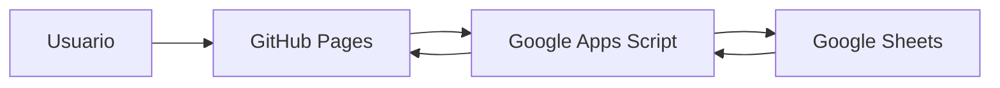

# Gestor Contable y Control Editorial Sustainability

Sistema web para controlar clientes, contratos, procesos editoriales, recuperación de cartera, pagos, investigadores, revistas y credenciales de acceso. La interfaz se publica en GitHub Pages y Google Sheets funciona como la única base de datos persistente.

## 1. Estado del software

El software está compilado y listo para publicarse. No necesita instalar Node.js, ejecutar comandos ni mantener un servidor propio para usarlo.

Para funcionar completamente requiere:

1. Publicar los archivos compilados en GitHub Pages.
2. Usar la hoja de cálculo de Google ya configurada o crear una nueva.
3. Instalar el archivo `google-apps-script/Code.gs` dentro de esa hoja.
4. Configurar una clave privada `SYNC_SECRET`.
5. Publicar Apps Script como aplicación web y conectar su URL `/exec` con la interfaz.
6. Importar los dos archivos Excel iniciales desde la aplicación.

## 2. Arquitectura



- **GitHub Pages:** aloja solamente HTML, CSS y JavaScript.
- **Google Apps Script:** valida la clave, recibe consultas y controla escrituras simultáneas.
- **Google Sheets:** almacena permanentemente todos los procesos y pagos.
- **Navegador:** mantiene temporalmente la sesión y los datos visibles. No utiliza `localStorage`, IndexedDB ni una base local.

La URL de Apps Script puede estar publicada en `cloud-config.json`. La clave `SYNC_SECRET` nunca debe subirse a GitHub; se ingresa en cada sesión y desaparece al cerrar o recargar la página.

## 3. Funciones incluidas

- Dashboard general con procesos, cartera, recaudación y estados.
- Control de clientes y temas.
- Formato único con todas las secciones del proceso.
- Control de contratos con fechas de inicio, fin y enlace al documento.
- Catálogo central de investigadores y selector de responsables.
- Procesos agrupados por investigador, fechas de asignación, honorarios y pagos.
- Producto desplegable: Latindex, Scielo, Scopus o WoS.
- Indexación desplegable: Latindex, Scielo, Q4, Q3, Q2 o Q1.
- Varias revistas por proceso, cada una con enlace, usuario y contraseña.
- Control de APC mediante opción sin APC/con APC y valor condicional.
- Datos de contacto e identificación del cliente.
- Factura del investigador con número, fecha, valor, estado y enlace.
- Archivos enlazados desde Google Drive con vista previa cuando Drive lo permite.
- Prioridad operativa: normal, urgente, estancado o espera del cliente.
- Avance gráfico entre 0 y 100 %.
- Pagos del cliente, cuotas, saldos y próximo vencimiento.
- Recuperación y antigüedad de cartera.
- Asignación y pago de investigadores.
- Alertas por pagos o fechas vencidas.
- Búsqueda global y filtros combinados.
- Importación de archivos Excel.
- Exportación de informes a Excel.
- Registro de actividad e historial.
- Sincronización automática cada 60 segundos.
- Conciliación por ID y control de revisiones simultáneas.
- Eliminaciones persistentes para impedir que registros borrados reaparezcan.

## 4. Información administrada

Cada proceso puede contener:

- ID.
- Cliente.
- Tema y producto.
- Pagos y saldo pendiente.
- Fecha y valor del próximo pago.
- Indexación.
- Estado editorial.
- Una o varias revistas, enlaces públicos, enlaces de acceso, usuarios y contraseñas.
- Condición de APC y valor, cuando aplique.
- Investigador actual y anterior, con inicio y fin de la asignación.
- Fecha de inicio y fin del contrato, además de las fechas del proceso y aceptación.
- Honorarios, valor pagado y factura del investigador.
- Número de contrato, enlace del contrato y orden de producción.
- Total contratado con el cliente.
- Correo, documento, teléfono, dirección e institución del cliente.
- Enlaces y vista previa de archivos almacenados en Google Drive.
- Prioridad operativa.
- Avance porcentual.
- Observaciones y fuentes de importación.

## 5. Publicación en GitHub Pages

### 5.1. Reemplazar los archivos anteriores

1. Descomprima `GestorContable.zip`.
2. Abra la carpeta `GestorContable`.
3. Suba **el contenido interno de esa carpeta** al repositorio `GestorContable`.
4. Reemplace el `index.html` anterior.
5. Confirme que en la raíz del repositorio existan:

```text
index.html
assets/
cloud-config.json
favicon.svg
.nojekyll
README.md
google-apps-script/
source-project/
```

El `index.html` correcto debe cargar un archivo similar a:

```html
<script type="module" src="./assets/index-XXXXXXXX.js"></script>
```

No debe contener:

```html
<script type="module" src="./src/main.tsx"></script>
```

### 5.2. Activar Pages

1. Abra el repositorio en GitHub.
2. Entre en **Settings → Pages**.
3. En **Build and deployment**, seleccione **Deploy from a branch**.
4. Seleccione la rama `main`.
5. Seleccione la carpeta `/ (root)`.
6. Pulse **Save**.
7. Espere entre uno y tres minutos.
8. Abra la URL publicada y recargue con `Ctrl + F5`.

Para este repositorio, la dirección esperada tiene el formato:

```text
https://grupoqueyam-cloud.github.io/GestorContable/
```

## 6. Actualizar o crear la base en Google Sheets

### Si ya utiliza la versión anterior

1. Antes de actualizar, abra Google Sheets y use **Archivo → Hacer una copia** como respaldo.
2. Abra **Extensiones → Apps Script** en la misma hoja que ya utiliza.
3. Reemplace completamente el contenido anterior de `Code.gs` con `google-apps-script/Code.gs` de este paquete.
4. Guarde y ejecute la función `configurarHojas`.
5. La migración conserva los procesos y pagos existentes, agrega las columnas nuevas, crea `Investigadores`, convierte la revista anterior en el primer acceso y copia las fechas anteriores del proceso como fechas contractuales cuando todavía no existen.
6. Los investigadores que ya aparezcan en los procesos se incorporan automáticamente al catálogo.
7. Revise manualmente y complete las nuevas fechas de asignación de cada investigador.
8. Publique una nueva versión de la misma implementación web como se explica en la sección 9.

No cree otra hoja ni cambie `SYNC_SECRET` o `cloud-config.json` si desea conservar la conexión existente.

### Si instala el sistema por primera vez

1. Ingrese a Google Drive.
2. Cree una hoja de cálculo vacía.
3. Coloque como nombre, por ejemplo, `Base central Gestor Contable`.
4. Mantenga la hoja restringida a las cuentas autorizadas.
5. Abra **Extensiones → Apps Script**.
6. En el editor, elimine el código de ejemplo.
7. Copie todo el contenido de `google-apps-script/Code.gs`.
8. Péguelo en el archivo `Code.gs` de Google y guarde.

## 7. Configurar la clave privada

1. En Apps Script abra **Configuración del proyecto**.
2. Busque **Propiedades de la secuencia de comandos**.
3. Pulse **Añadir propiedad**.
4. Configure:

```text
Propiedad: SYNC_SECRET
Valor: una clave privada larga de al menos 32 caracteres
```

Ejemplo de estructura — no utilice literalmente esta clave:

```text
Sust-Control-2026-cambiar-clave-7Kp9-Xm4Q
```

No coloque esta clave en GitHub, `cloud-config.json`, correos públicos o capturas.

## 8. Crear las pestañas de la base

1. En la parte superior de Apps Script seleccione la función `configurarHojas`.
2. Pulse **Ejecutar**.
3. Google solicitará autorización la primera vez.
4. Seleccione la cuenta propietaria de la hoja.
5. Revise los permisos y pulse **Permitir**.

La función creará las siguientes pestañas:

| Pestaña | Función |
|---|---|
| `Procesos` | Clientes, contratos, datos editoriales, cartera, investigadores y credenciales. |
| `PagosCliente` | Cuotas, valores, fechas programadas, pagos y estados. |
| `Historial` | Registro de importaciones, ediciones y sincronizaciones. |
| `Eliminados` | Identificadores borrados y fecha de eliminación. |
| `Configuracion` | Versión del esquema y número de revisión. |
| `Investigadores` | Catálogo de responsables, contacto, especialidad, vigencia y carpeta de Drive. |

No cambie los nombres de estas pestañas ni los encabezados de la primera fila.

## 9. Publicar Google Apps Script

1. En Apps Script pulse **Implementar → Nueva implementación**.
2. En tipo de implementación, seleccione **Aplicación web**.
3. En **Ejecutar como**, seleccione **Yo**.
4. En **Quién tiene acceso**, seleccione **Cualquiera**.
5. Pulse **Implementar**.
6. Copie la URL generada que termina en `/exec`.

Ejemplo:

```text
https://script.google.com/macros/s/IDENTIFICADOR/exec
```

No use la URL `/dev`. Si la cuenta empresarial no permite seleccionar **Cualquiera**, el administrador de Google Workspace debe habilitarlo; de lo contrario, GitHub Pages no podrá consultar el servicio sin iniciar sesión en Google.

Cuando modifique `Code.gs`, abra **Implementar → Gestionar implementaciones**, edite la implementación existente, seleccione **Nueva versión** y vuelva a implementar. Al editar la misma implementación, la URL `/exec` normalmente se conserva y no necesita cambiar `cloud-config.json`.

## 10. Preconfigurar la URL

Edite el archivo `cloud-config.json` ubicado en la raíz del repositorio:

```json
{
  "webAppUrl": "https://script.google.com/macros/s/IDENTIFICADOR/exec"
}
```

Guarde el cambio en la rama `main`. Esta URL no es una contraseña y puede publicarse.

También puede dejarla vacía y pegar la URL manualmente al abrir el sistema:

```json
{
  "webAppUrl": ""
}
```

## 11. Primera conexión

1. Abra la página de GitHub Pages.
2. Verifique o pegue la URL `/exec` de Apps Script.
3. Ingrese la misma clave definida como `SYNC_SECRET`.
4. Active **Cargar usuarios y contraseñas de revistas** únicamente si necesita ver o modificar esas columnas.
5. Pulse **Conectar y abrir sistema**.

La aplicación consultará Google Sheets. Si la clave es correcta, abrirá el dashboard. Si la hoja está vacía, el sistema mostrará cero procesos hasta realizar la importación.

## 12. Importar los Excel iniciales

1. Conecte primero la aplicación con Google Sheets.
2. Abra **Importar y exportar**.
3. Pulse **Seleccionar archivos**.
4. Seleccione simultáneamente:

```text
MATRIZ PRODUCCION SUST 2025.xlsx
CONTROL CLIENTES(3).xlsx
```

5. Espere la confirmación de guardado.
6. Revise las pestañas `Procesos` y `PagosCliente` en Google Sheets.

Los Excel se leen temporalmente en la memoria del navegador y sus datos se consolidan por ID y campos equivalentes. Los archivos originales no se suben a GitHub ni quedan guardados en el navegador.

## 13. Uso diario

### Crear un proceso

1. Pulse **Nuevo proceso**.
2. Si el responsable todavía no existe, cierre el formato, abra **Investigadores** y pulse **Nuevo investigador**.
3. Complete en el formato único los datos del cliente, contrato, producto, indexación, responsable y fechas obligatorias.
4. Seleccione la prioridad operativa.
5. Agregue revistas, accesos, APC, pagos, factura del investigador y archivos de Drive según corresponda.
6. Pulse **Guardar en Google Sheets**.

La pantalla se actualiza solo después de que Google Sheets confirma la escritura.

### Editar o eliminar

- Abra el registro desde la tabla.
- Modifique la información y guarde.
- Para eliminar, utilice el botón correspondiente y confirme.
- Las eliminaciones quedan registradas en `Eliminados`.

### Cartera

- Registre el total contratado.
- Registre el saldo pendiente.
- Añada las cuotas y fechas programadas.
- Actualice el estado a pendiente, parcial, pagado o vencido.
- El dashboard y las gráficas recalculan los indicadores automáticamente.

### Investigadores

- Abra **Investigadores → Nuevo investigador** para administrar el catálogo central.
- Solo los investigadores activos aparecen en el selector de nuevos procesos.
- Cada ficha agrupa los procesos asignados y muestra fechas, avance, cartera asociada, honorarios y pagos pendientes.
- Los investigadores desactivados no se eliminan y permanecen asociados a sus registros históricos.

### Búsqueda y filtros

La búsqueda revisa cliente, tema, producto, contrato, revista, investigador, estado, prioridad, institución e indexación. Los filtros permiten combinar estado, prioridad, responsable, indexación, riesgo de cartera y rango de fechas contractuales.

### Exportación

Desde **Importar y exportar**, pulse **Descargar Excel**. El informe contiene las pestañas `Procesos`, `Pagos cliente` e `Investigadores` con los datos vigentes obtenidos de Google Sheets.

## 14. Sincronización y trabajo simultáneo

- El sistema sincroniza automáticamente cada 60 segundos.
- Cada creación, edición, eliminación o importación se guarda inmediatamente.
- Apps Script utiliza un bloqueo para evitar escrituras simultáneas incompatibles.
- La pestaña `Configuracion` mantiene un número de revisión.
- Si otra persona modificó la hoja, el sistema vuelve a descargar y conciliar los registros.
- La conciliación utiliza el ID y la fecha `Actualizado`.
- Si Google Sheets no responde, el cambio no se confirma en la interfaz.

## 15. Seguridad

- Mantenga Google Sheets privado.
- Comparta la hoja solo con personal autorizado.
- Use una clave `SYNC_SECRET` única y extensa.
- Cambie la clave si sospecha que fue expuesta.
- No guarde la clave en archivos del repositorio.
- La clave permanece únicamente en la memoria de la pestaña abierta.
- Los usuarios y contraseñas de revistas se almacenan como celdas legibles para las personas con acceso a la hoja.
- Desactive la opción de credenciales cuando no sea necesario consultarlas.
- Los archivos de Drive no se copian al sistema: se guarda únicamente su enlace. La vista previa respeta los permisos definidos en Google Drive.
- GitHub Pages es público; la protección de los datos depende de Apps Script y `SYNC_SECRET`.

La versión actual utiliza una clave compartida para abrir la base. No incorpora cuentas individuales ni roles de acceso por empleado.

## 16. Solución de problemas

### Pantalla en blanco y error `application/octet-stream`

Causa: GitHub está publicando un `index.html` que intenta cargar `src/main.tsx`.

Solución:

1. Use este paquete `GestorContable.zip`.
2. Reemplace el `index.html` de la raíz.
3. Suba la carpeta `assets` completa.
4. Configure Pages en `main` y `/ (root)`.
5. Recargue con `Ctrl + F5`.

### Error 404 en `favicon.svg`

Confirme que `favicon.svg` esté junto a `index.html` en la raíz.

### La página continúa mostrando la versión anterior

- Espere entre uno y tres minutos después del cambio.
- Recargue con `Ctrl + F5`.
- Pruebe una ventana de incógnito.
- Revise **Settings → Pages** para confirmar la rama y carpeta.

### URL de Apps Script inválida

Use la URL de implementación terminada en `/exec`, no la URL del editor ni `/dev`.

### Clave incorrecta

El valor ingresado debe coincidir exactamente con `SYNC_SECRET`. Revise espacios al inicio o final.

### Google no devuelve JSON

- Verifique que la implementación sea una **Aplicación web**.
- Confirme **Ejecutar como: Yo**.
- Confirme **Acceso: Cualquiera**.
- Asegúrese de usar `/exec`.
- Si modificó el código, cree una nueva versión de la implementación.

### La hoja abre, pero no aparecen registros

- Ejecute `configurarHojas`.
- Verifique las pestañas creadas.
- Importe los Excel desde la aplicación.
- Revise que los encabezados no hayan sido modificados.

### La aplicación pide actualizar el esquema

El sitio nuevo requiere el esquema 2. Reemplace `Code.gs`, ejecute `configurarHojas` y publique una nueva versión de la implementación web. Después recargue GitHub Pages con `Ctrl + F5`.

### Un archivo de Drive no muestra vista previa

- Confirme que el enlace sea de Google Drive, Docs, Sheets o Slides.
- Revise que la cuenta del usuario tenga permiso para abrirlo.
- Algunos formatos o políticas de Google Workspace bloquean la inserción; en ese caso utilice **Abrir** para verlo en una pestaña nueva.

### No aparecen usuarios ni contraseñas

Cierre la sesión, vuelva a conectarse y active **Cargar usuarios y contraseñas de revistas**. Por seguridad, la opción está desactivada inicialmente.

## 17. Estructura del paquete

```text
GestorContable/
├── index.html                 página compilada para GitHub Pages
├── assets/                    JavaScript, ExcelJS y estilos compilados
├── cloud-config.json          URL pública de Apps Script
├── favicon.svg                icono del sitio
├── .nojekyll                  evita procesamiento de Jekyll
├── README.md                  este manual
├── google-apps-script/
│   └── Code.gs                servicio de Google Sheets
└── source-project/            código fuente completo de React y TypeScript
```

## 18. Actualizaciones y respaldos

- Para actualizar únicamente la URL de Google, edite `cloud-config.json`; no necesita recompilar.
- Para cambiar la estructura de Sheets, modifique `Code.gs` y publique una nueva versión de Apps Script.
- Para actualizar la interfaz, trabaje dentro de `source-project`, ejecute `npm install` y `npm run build`, y copie el contenido generado en `source-project/docs/` a la raíz del repositorio.
- Para respaldar la base, utilice **Archivo → Hacer una copia** en Google Sheets o descargue el reporte desde la aplicación.

## 19. Comprobación final

El sistema está correctamente configurado cuando:

- La URL de GitHub Pages muestra la pantalla de conexión.
- La consola no intenta descargar `src/main.tsx`.
- `favicon.svg`, los archivos de `assets/` y `cloud-config.json` responden sin error 404.
- La URL `/exec` acepta la clave.
- Se crean las seis pestañas de Google Sheets, incluida `Investigadores`.
- Los Excel se importan y aparecen en `Procesos`.
- Un investigador nuevo aparece en el selector del formato de procesos.
- Un proceso admite más de una revista y más de un archivo de Drive.
- Un registro nuevo aparece inmediatamente en la hoja.
- Al recargar la página, se solicita nuevamente la clave y los datos vuelven a descargarse desde Google Sheets.
